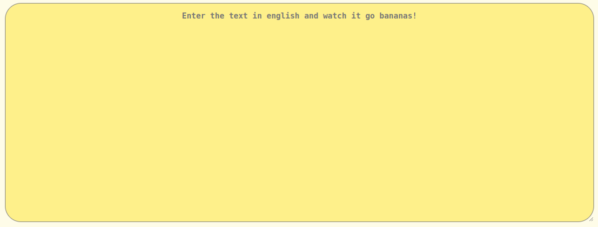
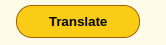
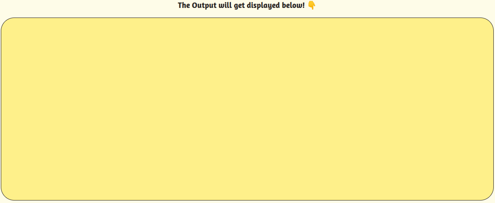

# Let's Talk Minionese!

## Made using HTML, CSS and JavaScript

Are you familiar with minions? If you are, then you are going to love this web-app!

This web-app can translate text from english to the language of minions! All you need to do is input your text in the **input field** and click on the **translate button**. The translated text will appear in the **output field**, just below the translate button. 

You can refer to the below images to understand the web-app better.

1. Input Field

2. Translate Button

3. Output Field

#### HAVE FUN TALKING MINIONESE!
